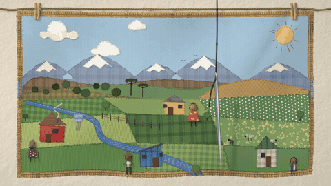

# «Hilván» — segunda intro animada de la Guía SATC

Una **arpillera chilena** animada en *stop-motion*: retazos de ropa usada cosidos sobre un saco
harinero, lana, hilo, una aguja y luz. **17 segundos**, generada **100 % con Python y en raster**
(nada vectorial: cada tela es un campo de altura iluminado con luz rasante, cada puntada un tubo de
hilo con torsión, cada lana tiene pelusa). Pensada como *hero* con scroll para la web.



> Video en alta calidad: [`output/hilvan_1920x1080.mp4`](output/hilvan_1920x1080.mp4) (16:9) y
> [`output/hilvan_1080x1920.mp4`](output/hilvan_1080x1920.mp4) (9:16, compuesto aparte para teléfono).
> Concepto y guion: [`hilo_rojo/CONCEPTO.md`](hilo_rojo/CONCEPTO.md).

## La metáfora, en una línea

Todo megaproyecto **empieza como un hilván**: puntadas provisorias, que por delante parecen sueltas
—unas estacas, un aviso en el cerco, una toma en el río, el contorno de una torre que todavía no
existe—. Cuando se tensa el hilo, **la tela se frunce entre las casas**. A contraluz se ve el revés:
**es un solo hilo**, y detrás de la torre viene **toda una línea de torres** que nadie había visto. La
comunidad marca cada señal con **lana roja**, avisa casa por casa, **saca el hilván antes de que sea
costura**, y la lana sube al cordel: de él cuelgan otras arpilleras, otros territorios, y el rojo
corre de una a otra. **Una red de alerta.** Al final, la misma aguja del comienzo borda la última
letra de «Alerta».

La forma viene de las **arpilleras de los talleres de la Vicaría de la Solidaridad**, que cosieron con
retazos sobre sacos harineros lo que la prensa callaba y que llevaban, al revés, un bolsillo con la
carta de quien las hizo. La pieza toma esa gramática con respeto y le da su crédito (en la web, el
llamado a leer la guía es ese bolsillo con su carta).

## Guion (16,93 s, 24 fps animados «en dos»: 12 imágenes únicas por segundo, 203 en total)

| Tiempo | Pilar | Qué pasa |
|---|---|---|
| 0,0–1,2 | **Conocer** | Póster: la arpillera cuelga de un cordel de cáñamo con perritos de ropa. Un valle del centro-sur con la cordillera nevada, araucarias, río, potreros, el estanque del APR, casas y vecinas de lana. Una aguja grande, enhebrada con hilo negro, cuelga cerca de la cámara y se mece; el foco pasa de la tela a la aguja (algo está por coserse) y la aguja baja a la tela. |
| 1,2–4,6 | **Vigilar** | Corte a un primer plano quieto: la aguja hilvana, en orden, cuatro estacas de topógrafo con cinta naranja, un **AVISO** prendido al cerco con alfiler de gancho y una cañería con su llave de paso que sale del río. Corte al plano general: en el cerro hilvana la **torre de alta tensión, solo como contorno de puntadas largas**, a futuro. Tira del hilo: la tela se frunce a lo largo del hilo y en abanico en cada huella, y las casas de los extremos se ladean. |
| 4,65–7,9 | **Alertar** | La sala se apaga y la tela se vuelve linterna. Una lámpara de mano, por detrás (se adivina la sombra de la mano que la sostiene), sigue el hilo: pasa por las estacas, el aviso y la cañería (sus pinchazos se encienden; ahí solo se ve esa hebra), sube a la torre del cerro y baja por **una línea de torres escondida**, cosida por el revés, que solo aparece donde llega la luz, torre por torre, hasta **la puerta de la casa roja**, donde se queda. Después se levanta: **la línea completa**, una sola vez, sobre el saco que dice **HARINA · MOLINO LA ESPERANZA**. Clic: todo a oscuras, y el tubo de la sala prende, se corta y vuelve a prender. |
| 8,0–11,9 | **Responder** | La lana roja **calca por delante la ruta escondida**, con un nudo en cada torre (en 16:9 sale de la mano de la vigía; en 9:16 parte anudada en la torre del cerro), y pasa **de mano en mano**: cada vecina y vecino la toma y se enciende su ventana. Corte: la vigía toma el hilván, se echa hacia atrás y tira; la torre del cerro se descose puntada a puntada hacia la maraña de hilo a sus pies. En el plano general, **toda la ruta escondida se frunce por delante y se suelta** desde la punta. La lámpara vuelve detrás casi un segundo: **el revés está vacío**, solo quedan los pinchazos que dibujan cada torre, con la lana roja encima, roja a contraluz. |
| 11,9–16,93 | **Red** | La lana sube y se anuda al cordel; la cámara se aleja por pasos, con paralaje: del cordel cuelgan otras arpilleras (un desierto con un parque solar, un campo cruzado por torres). Desde el nudo, **el rojo corre por el cordel**, baja a cada vecina y enciende su ventana. **La aguja del comienzo baja desde el nudo por un hilo rojo** hasta la tira del título, borda la «a» final de «Alerta» (que estaba a lápiz) y queda en el margen: el título también es parte de la red. |

## Archivos

| Archivo | Qué es |
|---|---|
| `output/hilvan_1920x1080.mp4` | 16:9, H.264, 16,93 s, 24 fps («en dos») |
| `output/hilvan_1080x1920.mp4` | 9:16 para teléfono, compuesto aparte |
| `output/hilvan_*_voz.mp4` | Los mismos videos con voz en off (mujer, español latinoamericano) y música original; guion en [`GUION_VOZ.md`](GUION_VOZ.md) |
| `output/hilvan_voz.srt`, `.vtt` | Subtítulos de la voz en off |
| `output/audio/` | La mezcla (`hilvan_mezcla.wav`, `.m4a`) y las pistas separadas de voz y música |
| `output/hilvan_*_scroll.mp4` | Las mismas a 12 imágenes por segundo, todas cuadro clave (para mover con `video.currentTime`) |
| `output/hilvan_poster_*.png` | Cuadro 0, el contraluz con la línea completa (7,0 s) y el cuadro final, en los dos formatos |
| `output/hilvan_vista_previa.gif` | Vista previa liviana |
| `web/hilvan/index.html` | La intro con scroll: 7 paradas con texto en HTML, `<h1>` real, bolsillo con la carta |
| `web/hilvan/frames/landscape`, `tall` | Imágenes WebP de la web (16:9 y 9:16) |
| `web/hilvan/bolsillo.webp` | El revés de la arpillera con el bolsillo y la carta (llamado a leer la guía) |
| `hilo_rojo/` | El código |

## Cómo generarla

```bash
pip install -r requirements.txt
./build_hilvan.sh          # MP4 16:9 y 9:16, versiones para scroll, WebP de la web, pósters, GIF
```

Con 4 núcleos, cada formato tarda ≈ 3 min (203 imágenes únicas). Para probar la web:
`python -m http.server` en la raíz y abrir `http://localhost:8000/web/hilvan/`.

## Cómo está hecho (`hilo_rojo/`)

| Módulo | Qué hace |
|---|---|
| `textile.py` | Tejidos procedurales con relieve y luz rasante: yute grueso con hebras de grosor lognormal y nudos (calculado al doble de resolución, sin moiré), algodón, cuadrillé, lunares, rayas, estampado, franela, pana, fieltro y raso; transmisión de luz para el contraluz. |
| `thread.py` | Hilos como tubos con torsión, cabos y brillo; puntadas con comba; lana continua con pelusa y puntadas de fijación (*couching*); nudos franceses, punto atrás, satén y festón. |
| `pieces.py` | Retazos cortados a tijera (contorno ondulado, muescas, hebras sueltas), gastados (desteñido, *pilling*, manchas), acolchados y fijados con puntada corrida; se posan en *stop-motion*. |
| `figures.py` | Casas distintas entre sí, árboles de fieltro, araucarias, cordillera nevada, sol, nubes, muñecas con cabeza de lana enrollada y poses, la aguja, texto bordado con tildes (fuentes Hershey de un solo trazo). |
| `signals.py` | Las huellas del megaproyecto: estacas, AVISO con alfiler de gancho, toma de agua con caseta y la torre hilvanada. |
| `territory.py` | La arpillera (16:9 y 9:16 compuestas por separado), el estarcido del saco y las arpilleras vecinas. |
| `scene.py` | La línea de tiempo: aguja, frunce, lámpara de mano (con la sombra de la mano), el revés con la línea de torres cosida, la lana y el relevo de mano en mano, el descosido y la maraña, el revés vacío; los encuadres de cámara. |
| `world.py` | La pared encalada, el cordel, los perritos, las telas colgadas (comba y pliegues), la tira del título (con un control automático de legibilidad del bordado: si una letra pierde su punto, su tilde o su travesaño, el render se detiene), la cámara por cortes y pasos con paralaje por capas y foco, el frente rojo y los péndulos, la aguja del cierre, el grano y el bamboleo de película. |
| `bolsillo.py` | El revés con el bolsillo y la carta, para la web. |
| `render.py` | Render en paralelo y codificación con ffmpeg. |
| `guion.py` | El guion de la voz en off: cada frase con su ventana de tiempo, lo que se ve y cómo decirla. |
| `sonido.py` | La voz (Piper, varias tomas por frase y la mejor), la cadena de locución, la mezcla a -16 LUFS y los MP4 con sonido. |
| `musica.py` | La música original, sintetizada: guitarra y charango (Karplus-Strong con caja de madera), bombo legüero, bordón, vidrio y ruidos de sala, al pulso del video. |

## Verificación

(ver [`hilo_rojo/VERIFICACION.md`](hilo_rojo/VERIFICACION.md))
